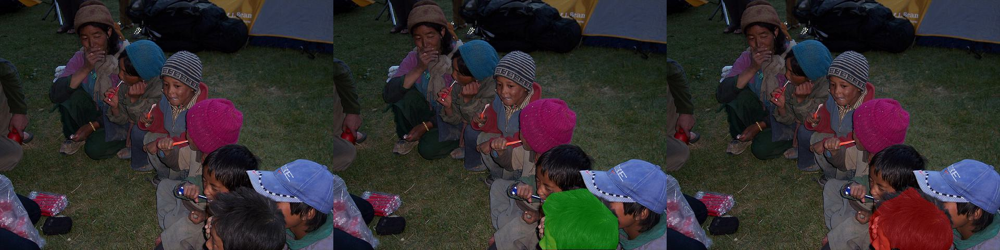
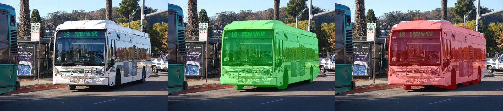
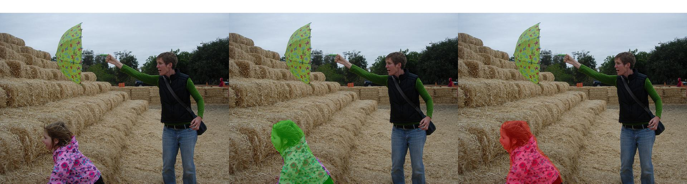
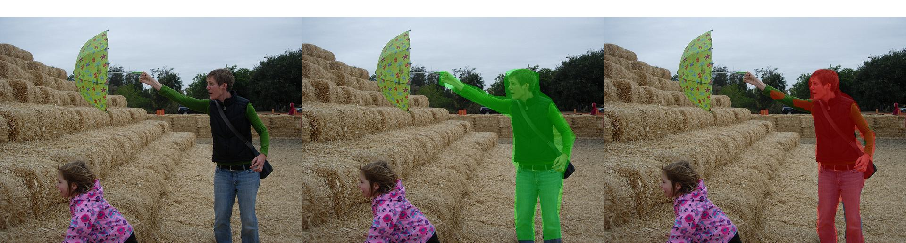

# SAM3


# 4.8工作

编译好了flash-Attention，训练时间缩短三分之一

claude推荐使用一个pixel shuffle，ablation看一下效果。


# 下一步的ablation

- [ ] loss：目前以BCE+Dice主导（weight还得调整），尝试boundary loss
- [ ] anchorloss的pre-merger和post-merger

# debug
## decoder的input

SAM3的decoder需要输入两种feature
- text prompt
- image feature

QWen的vision encoder处理图片后，进行merger从而提高计算效率降低开销。

之前的bug是提取Post-merger的图像特征，但是这样发现在同样训练参数下loss会升高。

更新：修改成了pre-merger的图像特征。

## 训练过程中loss的计算方式
### anchorcosineloss
anchorcosineloss是从某句话的回答中提取出<anchor\_1>位置，查询到HiddenState，去和经过visionEncoder的图像的真实anchor区域pooling

之前的bug是在LLM层中提取anchorfeature，再和<anchor\_1>这一token的hiddenstate对齐（这俩实际上是一个东西），

更新：当backward到anchorloss的时候，读取anchor的mask并且计算anchor区域，在Post-merger后的imagefeature中做这一区域的池化计算，和<anchor_\1>token的Hiddenstate做cosine，目的是让LLM里的<anchor\_1>token 的hiddenstate去靠近视觉区域语义。

- [ ] TODO：对比mask的vision feature使用post/pre-merger谁能带来更好的focus和seg效果？

### segloss
segloss目前的计算公式为：

$$segloss= 2.0*loss_{BCE}+0.5*loss_{Dice}+0.5*loss_{IoU}$$

之前的bug是直接使用了逐像素IoU作为loss，发现不对劲就删除了。

更新：目前的IoUloss是SAM3原生的用于提高mask分割质量的一个loss（非主导loss），这个在SAM3的forward中负责选出多个mask中最佳的那一个

- [x] Ablation：IoUloss是否有用 没有用

### boundary loss
Claude给我推荐：如果分辨率低的话，可以试试boundary loss，可以做一下Ablation

## ZeRo3的切片问题
ckpt的保存和最终权重保存会崩溃，提示权重为(\[0,\])，后面直接让AI修了也不报错了。


## 数据集问题
<target_1>这个token出现的位置太靠前，比如在这一个中：

```json
"conversations": [
      {
        "from": "human",
        "value": "<image>\nSegment the sink that is to the bottom left of the doorknob."
      },
      {
        "from": "gpt",
        "reasoning": "I first find the doorknob<anchor_1>, then I look for the sink<target_1> to its bottom left.",
        "value": "It's sink<target_1>."
      }
    ]
```
虽然tgt_1确实跟在sink后并且传到decoder中，但是忽视了后续的“to its bottom left”，从而导致自回归的时候就丢失了这一信息，tgt_1的输出实际上是有缺陷的。


###
# pipeline
``` markdown
1 Step 1: Smart Resize
2 ━━━━━━━━━━━━━━━━━━
3 原图: 640 × 768 = 491,520 像素
4 min_pixels=200,704  max_pixels=1,003,520
5 491,520 在范围内 → 不需要缩放
6
7 但需要对齐到 patch_size×merge_size = 14×2 = 28 的倍数：
8   640 → 644 (最近的 28 的倍数: 28×23=644)
9   768 → 784 (28×28=784)
10 smart resize → 644 × 784
11
12 Step 2: Qwen ViT
13 ━━━━━━━━━━━━━━━━
14 patch_size=14:
15   644/14 = 46 patches (H)
16   784/14 = 56 patches (W)
17   → 46 × 56 = 2,576 tokens
18
19 spatial_merge_size=2 (merge 后给 LLM 的 token 数):
20   46/2 = 23
21   56/2 = 28
22   → 23 × 28 = 644 tokens 给 LLM
23
24 但 pre-merger grid (喂给 seg_head 的):
25   h_pre = 46, w_pre = 56
26
27 Step 3: Vision Proj + FPN
28 ━━━━━━━━━━━━━━━━━━━━━━━━
29 vision_proj: [2576, D_qwen] → [2576, 256] → reshape → [1, 256, 46, 56]
30
31 fpn_2x: [1, 256, 46, 56] → [1, 256, 92, 112]
32 fpn_4x: [1, 256, 46, 56] → [1, 256, 184, 224]
33
34 Step 4: MaskDecoder
35 ━━━━━━━━━━━━━━━━━━
36 TwoWayTransformer 在 46×56 = 2,576 tokens 上运行
37 output_upscaling 4x: [46×4, 56×4] = [184, 224]
38
39 high_res_features 融合:
40   feat_s1: conv_s1(92×112)  → [1, 64, 92, 112]
41   feat_s0: conv_s0(184×224) → [1, 32, 184, 224]
42
43 mask 输出: [Q, 1, 184, 224]
44
45 Step 5: Interpolate to Original
46 ━━━━━━━━━━━━━━━━━━━━━━━━━━━━━━
47 F.interpolate: [184, 224] → [640, 768]
48 放大倍数: ~3.5x (640/184) 和 ~3.4x (768/224)
49
50 Step 6: Loss
51 ━━━━━━━━━━━
52 pred mask: [640, 768]  vs  GT mask: [640, 768]
53 pixel-level Focal + Dice loss
```
# 新设计
<anchor\_1>到<anchor\_8>特殊token用于标记anchor，让模型学习到anchor特征；<target\_1>用于标记分割目标，提取目标hiddenstate用于分割。

$$loss = w_{text}*TextLoss+ w_{anchor}*AnchorCosineLoss + w_{seg}*TargetSegLoss(BCE+Dice+IoU)$$

# 在refcoco上进行Train和eval

## v1效果




## v2效果




# anchor-target simple example
```json
{
    "image": "images/coco2017train/000000522418.jpg",
    "conversations": [
      {
        "from": "human",
        "value": "<image>\nSegment the sink that is to the bottom left of the doorknob."
      },
      {
        "from": "gpt",
        "reasoning": "I first find the doorknob<anchor_1>, then I look for the sink to its bottom left<target_1>.",
        "value": "It's sink<target_1>."
      }
    ],
    "masks": {
      "anchor": [
        {
          "token": "<anchor_1>",
          "id": "lvis:25333"
        }
      ],
      "target": [
        {
          "token": "<target_1>",
          "id": "lvis:25334"
        }
      ]
    }
  }
```
mask通过\[DatasetName:ID\]映射查询

这个样例数据过于简单，还需增强
